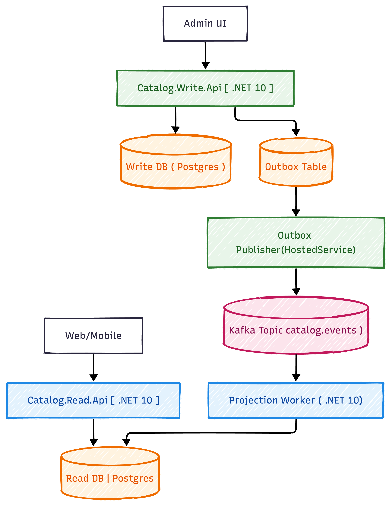

# CQRS Catalog (.NET 10, Kafka, PostgreSQL)


A production-style CQRS starter for a `Catalog` domain with:

- Write side API and domain layers
- Read side API optimized for queries
- Projection worker for event-driven read model updates
- Kafka as event backbone
- PostgreSQL with separate write/read databases

## Table Of Contents

- [Quick Start (2-minute)](#quick-start-2-minute)
- [Overview](#overview)
- [Architecture](#architecture)
- [Architecture Decisions](#architecture-decisions)
- [Repository Tabs](#repository-tabs)
- [Tech Stack Summary](#tech-stack-summary)
- [NuGet Libraries Summary](#nuget-libraries-summary)
- [Getting Started](#getting-started)
- [Run The Services](#run-the-services)
- [Verify Local Setup](#verify-local-setup)
- [Current Status](#current-status)
- [Roadmap](#roadmap)
- [Contributing](#contributing)
- [Branch Strategy](#branch-strategy)
- [Commit Convention](#commit-convention)

## Quick Start (2-minute)

```bash
# 1) start infra
docker compose -f infra/docker-compose.yml up -d

# 2) run write api
dotnet run --project src/Catalog.Write.Api

# 3) run read api (new terminal)
dotnet run --project src/Catalog.Read.Api

# 4) run projection worker (new terminal)
dotnet run --project src/Catalog.Projection.Worker
```

Open:

- Kafka UI: `http://localhost:8080`
- Write API: `http://localhost:5127/weatherforecast`
- Read API: `http://localhost:5266/weatherforecast`

## Overview

This repository follows CQRS principles:

- Commands and transactional consistency live on the **write side**
- Queries and denormalized models live on the **read side**
- Domain changes are propagated asynchronously through **events**
- Reliability patterns are prepared using **Outbox** and **Idempotency** tables

## Architecture

### Project Architecture Diagram

Place your attached image at this path:

- `docs/images/cqrs-architecture.png`

Then this will render on GitHub:



### Mermaid Reference Diagram

```mermaid
flowchart LR
  A[Admin UI] --> B[Catalog.Write.Api (.NET 10)]
  B --> C[(Write DB - Postgres)]
  B --> D[(Outbox Table)]
  D --> E[Outbox Publisher Hosted Service]
  E --> F[(Kafka Topic: catalog.events)]
  F --> G[Projection Worker (.NET 10)]
  H[Web/Mobile] --> I[Catalog.Read.Api (.NET 10)]
  G --> J[(Read DB - Postgres)]
  I --> J
```

## Architecture Decisions

| Decision | Why It Exists | Outcome |
|---|---|---|
| Separate Write and Read Databases | Command and query workloads have different access patterns | Independent optimization and clearer boundaries |
| Outbox Table (`outbox_messages`) | Prevent lost events between DB commit and broker publish | Reliable event delivery with retry support |
| Kafka Topic (`catalog.events`) | Decouple producers from consumers | Async scaling and independent evolution of projections |
| Projection Worker + Idempotency (`processed_events`) | Consumers may receive duplicates or retries | Exactly-once effect on read model updates |
| Read Model Denormalization (`catalog_product_read`) | Query APIs need fast, simple lookups | Lower latency and simpler query handlers |
| CQRS Layered Projects | Keep API, domain, app, and infrastructure concerns separated | Better maintainability and testability |

## Repository Tabs

Use this as a quick navigation map when browsing the GitHub repo.

| Tab | Purpose | Path |
|---|---|---|
| Write API | Command endpoints (create/update flows) | `src/Catalog.Write.Api` |
| Write Application | Use cases, command handlers, validation | `src/Catalog.Write.Application` |
| Write Domain | Domain model and business rules | `src/Catalog.Write.Domain` |
| Write Infrastructure | Persistence/integration for write side | `src/Catalog.Write.Infrastructure` |
| Read API | Query endpoints | `src/Catalog.Read.Api` |
| Read Infrastructure | Query persistence/read adapters | `src/Catalog.Read.Infrastructure` |
| Projection Worker | Kafka consumer + projection updater | `src/Catalog.Projection.Worker` |
| Shared | Cross-cutting contracts/utilities | `src/Catalog.Shared` |
| Infra | Docker Compose + SQL bootstrap scripts | `infra/` |
| Docs | Learning notes and phase documentation | `docs/` |

## Tech Stack Summary

| Area | Technology | Version | Source |
|---|---|---|---|
| Framework | .NET | `net10.0` | `src/Catalog.Write.Api/Catalog.Write.Api.csproj` |
| Web API | ASP.NET Core | `10.0.3` | `src/Catalog.Write.Api/Catalog.Write.Api.csproj` |
| API Docs | OpenAPI (`Microsoft.AspNetCore.OpenApi`) | `10.0.3` | `src/Catalog.Read.Api/Catalog.Read.Api.csproj` |
| API Docs UI | Swagger (`Swashbuckle.AspNetCore`) | `10.1.4` | `src/Catalog.Write.Api/Catalog.Write.Api.csproj` |
| Messaging | Apache Kafka (Confluent image) | `7.6.1` | `infra/docker-compose.yml` |
| Kafka Coordination | Zookeeper (Confluent image) | `7.6.1` | `infra/docker-compose.yml` |
| Kafka UI | Provectus Kafka UI | `latest` | `infra/docker-compose.yml` |
| Database | PostgreSQL | `16` | `infra/docker-compose.yml` |
| ORM / Data Access | EF Core | `10.0.3` | `src/Catalog.Write.Infrastructure/Catalog.Write.Infrastructure.csproj` |
| ORM Provider | Npgsql EF Core Provider | `10.0.0` | `src/Catalog.Write.Infrastructure/Catalog.Write.Infrastructure.csproj` |
| SQL Mapper | Dapper | `2.1.66` | `src/Catalog.Read.Infrastructure/Catalog.Read.Infrastructure.csproj` |
| PostgreSQL Driver | Npgsql | `10.0.1` | `src/Catalog.Read.Infrastructure/Catalog.Read.Infrastructure.csproj` |
| CQRS Handler Pipeline | MediatR | `14.0.0` | `src/Catalog.Write.Application/Catalog.Write.Application.csproj` |
| Validation | FluentValidation | `12.1.1` | `src/Catalog.Write.Application/Catalog.Write.Application.csproj` |
| Worker Hosting | Microsoft.Extensions.Hosting | `10.0.3` | `src/Catalog.Projection.Worker/Catalog.Projection.Worker.csproj` |
| Kafka Client | Confluent.Kafka | `2.13.0` | `src/Catalog.Projection.Worker/Catalog.Projection.Worker.csproj` |

## NuGet Libraries Summary

| Package | Version | Used In |
|---|---|---|
| `Confluent.Kafka` | `2.13.0` | `src/Catalog.Projection.Worker/Catalog.Projection.Worker.csproj` |
| `Dapper` | `2.1.66` | `src/Catalog.Read.Infrastructure/Catalog.Read.Infrastructure.csproj`, `src/Catalog.Write.Infrastructure/Catalog.Write.Infrastructure.csproj`, `src/Catalog.Projection.Worker/Catalog.Projection.Worker.csproj` |
| `FluentValidation` | `12.1.1` | `src/Catalog.Write.Application/Catalog.Write.Application.csproj` |
| `MediatR` | `14.0.0` | `src/Catalog.Write.Application/Catalog.Write.Application.csproj`, `src/Catalog.Write.Api/Catalog.Write.Api.csproj` |
| `Microsoft.AspNetCore.OpenApi` | `10.0.3` | `src/Catalog.Read.Api/Catalog.Read.Api.csproj`, `src/Catalog.Write.Api/Catalog.Write.Api.csproj` |
| `Microsoft.EntityFrameworkCore` | `10.0.3` | `src/Catalog.Write.Infrastructure/Catalog.Write.Infrastructure.csproj` |
| `Microsoft.EntityFrameworkCore.Design` | `10.0.3` | `src/Catalog.Write.Infrastructure/Catalog.Write.Infrastructure.csproj` |
| `Microsoft.Extensions.Hosting` | `10.0.3` | `src/Catalog.Projection.Worker/Catalog.Projection.Worker.csproj` |
| `Npgsql` | `10.0.1` | `src/Catalog.Read.Infrastructure/Catalog.Read.Infrastructure.csproj`, `src/Catalog.Projection.Worker/Catalog.Projection.Worker.csproj` |
| `Npgsql.EntityFrameworkCore.PostgreSQL` | `10.0.0` | `src/Catalog.Write.Infrastructure/Catalog.Write.Infrastructure.csproj` |
| `Swashbuckle.AspNetCore` | `10.1.4` | `src/Catalog.Write.Api/Catalog.Write.Api.csproj` |

## Getting Started

### Prerequisites

- .NET 10 SDK
- Docker Desktop
- Git

Check versions:

```bash
dotnet --version
docker --version
git --version
```

### 1) Start Infrastructure

From repo root:

```bash
docker compose -f infra/docker-compose.yml up -d
```

This starts:

- `cqrs_postgres` on `localhost:5432`
- `cqrs_zookeeper` on `localhost:2181`
- `cqrs_kafka` on `localhost:9092`
- `cqrs_kafka_ui` on `localhost:8080`

### 2) Create/Verify Kafka Topic

Auto-create is enabled for local development, but you can create explicitly:

```bash
docker exec -it cqrs_kafka kafka-topics \
  --bootstrap-server localhost:9092 \
  --create \
  --topic catalog.events \
  --partitions 3 \
  --replication-factor 1
```

List topics:

```bash
docker exec -it cqrs_kafka kafka-topics \
  --bootstrap-server localhost:9092 \
  --list
```

### 3) Database Bootstrap

Postgres initialization scripts in `infra/sql` run automatically on first container initialization:

- `infra/sql/00-create-dbs.sql`
- `infra/sql/10-write-schema.sql`
- `infra/sql/20-read-schema.sql`

If volume already exists, re-run by removing the volume and starting again:

```bash
docker compose -f infra/docker-compose.yml down -v
docker compose -f infra/docker-compose.yml up -d
```

## Run The Services

Open separate terminals from repo root:

### Write API

```bash
dotnet run --project src/Catalog.Write.Api
```

Default local URL (from launch settings): `http://localhost:5127`

### Read API

```bash
dotnet run --project src/Catalog.Read.Api
```

Default local URL: `http://localhost:5266`

### Projection Worker

```bash
dotnet run --project src/Catalog.Projection.Worker
```

## Verify Local Setup

### Kafka UI

Open: `http://localhost:8080`

Expected:

- Cluster: `local`
- Topic: `catalog.events`

### PostgreSQL

List databases:

```bash
docker exec -it cqrs_postgres psql -U postgres -c "\l"
```

List write-side tables:

```bash
docker exec -it cqrs_postgres psql -U postgres -d catalog_write -c "\dt"
```

List read-side tables:

```bash
docker exec -it cqrs_postgres psql -U postgres -d catalog_read -c "\dt"
```

## Current Status

This repo is currently in early foundation phase:

- Infrastructure and schema for CQRS are in place
- Solution/project layering is created
- API and worker projects still contain starter template code
- Domain flows, event publishing, and projections are pending implementation

## Roadmap

1. Implement write-side product commands and validations.
2. Persist domain events to `outbox_messages`.
3. Publish outbox events to Kafka (`catalog.events`).
4. Consume events in projection worker and upsert read models.
5. Expose query endpoints from `Catalog.Read.Api`.
6. Add tests (unit + integration with local infra).

## Contributing

1. Create a feature branch from `main`.
2. Keep PRs focused and small enough to review quickly.
3. Update `README.md` or `docs/` when behavior/setup changes.
4. Include tests for non-trivial domain or integration changes.
5. Run build and basic local checks before opening PR.

Recommended local checks:

```bash
dotnet restore
dotnet build CqrsCatalog.slnx
```

## Branch Strategy

| Branch | Purpose |
|---|---|
| `main` | Stable integration branch |
| `feature/<scope>-<short-description>` | New features and enhancements |
| `fix/<scope>-<short-description>` | Bug fixes |
| `chore/<scope>-<short-description>` | Tooling, docs, maintenance |

Examples:

- `feature/catalog-create-product-command`
- `fix/projection-idempotency-check`
- `chore/readme-tech-stack-sync`

## Commit Convention

Use conventional-style commits:

| Type | Use For |
|---|---|
| `feat` | New behavior or capability |
| `fix` | Bug fix |
| `refactor` | Internal restructuring without behavior change |
| `test` | Adding or improving tests |
| `docs` | Documentation only |
| `chore` | Tooling/build/housekeeping |

Format:

```text
<type>(<scope>): <short summary>
```

Examples:

- `feat(write-api): add create product command endpoint`
- `fix(worker): skip already processed event ids`
- `docs(readme): add architecture decisions table`
